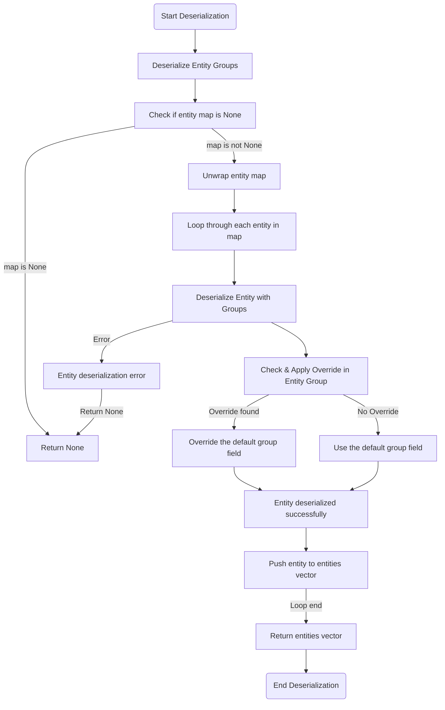

# Profile
[return to list of guides](../README.MD)

```mermaid
graph TD
    Start(Start Deserialization)
    DeserializeGroups[Deserialize Entity Groups]
    CheckMap[Check if entity map is None]
    NoneMap[Return None]
    UnwrapMap[Unwrap entity map]
    LoopEntities[Loop through each entity in map]
    DeserializeEntity[Deserialize Entity with Groups]
    CheckOverride[Check & Apply Override in Entity Group]
    EntityDeserialized[Entity deserialized successfully]
    EntityOverride[Override the default group field]
    EntityNoOverride[Use the default group field]
    EntityError[Entity deserialization error]
    PushEntity[Push entity to entities vector]
    ReturnEntities[Return entities vector]
    End(End Deserialization)

    Start --> DeserializeGroups
    DeserializeGroups --> CheckMap
    CheckMap -->|map is None| NoneMap
    CheckMap -->|map is not None| UnwrapMap
    UnwrapMap --> LoopEntities
    LoopEntities --> DeserializeEntity
    DeserializeEntity --> CheckOverride
    CheckOverride -->|Override found| EntityOverride --> EntityDeserialized
    CheckOverride -->|No Override| EntityNoOverride --> EntityDeserialized
    EntityDeserialized --> PushEntity
    PushEntity -->|Loop end| ReturnEntities
    DeserializeEntity -->|Error| EntityError
    EntityError -->|Return None| NoneMap
    ReturnEntities --> End
```

[return to list of guides](../README.MD)
